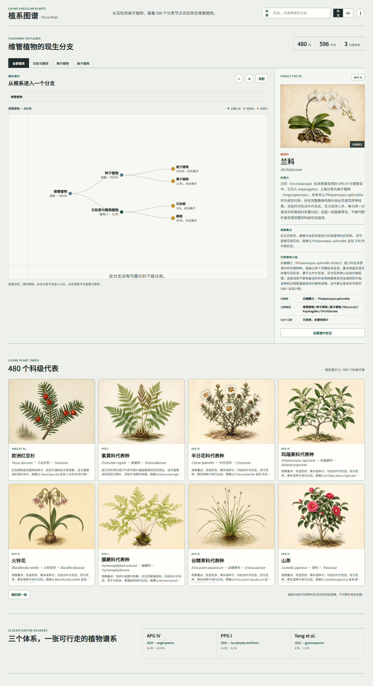
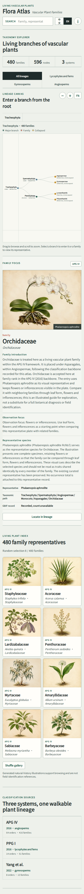

# Vascular Plant Atlas

<p>
  <b>维管植物科级图鉴</b> · 480 个现生科 · APG IV / PPG I / 裸子植物分类系统
</p>

<p>
  <a href="README_EN.md">English</a> ·
  <a href="https://seanwong17.github.io/Vascular-Plant-atlas/"><b>👉 点击进入：在线图鉴</b></a>
</p>

## 项目简介

这是一个静态的维管植物科级分类探索工具。它将 596 个分类节点组织成可进入的谱系画布，并为 480 个现生科提供代表种图版、中文详细介绍和英文详细介绍。页面支持中文 / English 切换、分类系统筛选、科名与代表种搜索、谱系缩放、焦点详情和随机画廊。

主项目保留了 `Vascular-Plant-atlas` 的数据、许可证、来源和 GitHub Pages 部署配置，并吸收了 `Flora-tree` 的谱系工作台、中文展示元数据、详情注释和本地数据契约测试。`Chordata-atlas` 中经过验证的双语字段和语言切换模式也被用于植物详情内容，但未引入动物项目的年代树等无关功能。



移动端和英文详情切换示例：

## 数据与脚本

```text
assets/images/                     480 张统一为 800 × 600 的 WebP 植物图版
data/taxonomy.json                 分类节点与来源
data/family_representatives.json   科级代表种与图像记录
data/specimens.json                精选观察记录
data/images_manifest.json          图像清单
data/display_metadata.json         480 条中英文科简介、观察要点与代表种介绍
src/app.js                         谱系画布、详情面板、搜索和双语交互
src/styles.css                     工作台与响应式视觉样式
scripts/build-display-metadata.js  生成 / 更新展示元数据
scripts/validate-atlas.mjs         完整性校验
tests/data-contract.test.js        数据契约测试
```

```bash
npm install
npm start
# open http://localhost:4173

npm run check
npm run data:display
```

图像用于教育性浏览和形态参考，不替代标本、原始照片、专业植物学图版或野外鉴定资料。

## 来源

- [APG IV (2016)](https://doi.org/10.1111/boj.12385)：被子植物
- [PPG I (2016)](https://doi.org/10.1111/jse.12229)：石松类与蕨类
- [Yang et al. (2022)](https://doi.org/10.1016/j.pld.2022.05.003)：裸子植物
- [GBIF Backbone Taxonomy](https://www.gbif.org/dataset/d7dddbf4-2cf0-4f39-9b2a-bb099caae36c)：代表种选择与物种核对

完整来源字段和选择方法保存在 `data/family_representatives.json` 与 `data/taxonomy.json`。

## 许可

代码、整理后的数据和项目图像采用 [CC BY-NC-SA 4.0](LICENSE) 发布。使用时请保留 Sean Wong 署名，并遵守非商业和相同方式共享条件。

## 维护：同步上游内容（保留自定义样式）

本仓库 fork 自 [SeanWong17/Vascular-Plant-atlas](https://github.com/SeanWong17/Vascular-Plant-atlas)。原项目更新时，只同步「内容」，样式（`src/styles.css`）始终保留本地版本。

### 一次性配置（已完成）

```bash
git remote add upstream https://github.com/SeanWong17/Vascular-Plant-atlas.git
git config merge.ours.driver true        # 启用 styles.css 的 merge=ours 兜底保护
```

`.gitattributes` 已为 `src/styles.css` 标记 `merge=ours`：即使误执行 `git merge upstream`，该文件也会自动保留本地版本。真正的保护仍是「永不对其执行 `git checkout upstream/main --`」。

### 每次同步上游更新

```bash
git fetch upstream
git checkout upstream/main -- data/ assets/ index.html   # 只同步内容（数据、图片、页面结构）
# 如需同步原项目逻辑更新：git checkout upstream/main -- src/app.js
# 永远不要执行：git checkout upstream/main -- src/styles.css
git add data/ assets/ index.html
git commit -m "sync upstream content"
git push origin main
```

### 文件归属约定

| 路径 | 归属 | 同步策略 |
|---|---|---|
| `data/` `assets/` `index.html` | 内容 | 跟随 upstream（每次 checkout） |
| `src/app.js` | 逻辑 | 视情况 `git diff` 审查后决定 |
| `src/styles.css` | 本地样式 | 永不 checkout，受 `merge=ours` 保护 |
